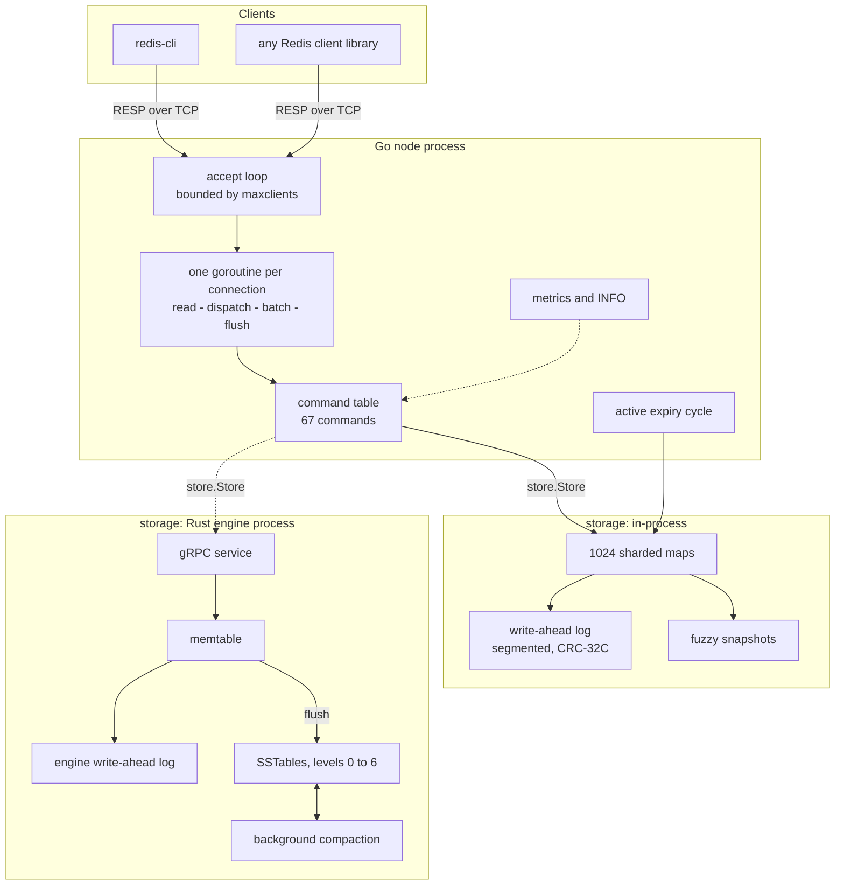

# HLD-001: Single-node architecture

- Status: implemented
- Phases: 1 to 3
- Related: [ADR-001](../adr/ADR-001-durability-model.md), [ADR-002](../adr/ADR-002-pluggable-storage-boundary.md)

## What this node is

A Redis-compatible key-value server that speaks RESP2 and RESP3, survives
`kill -9` without losing acknowledged writes, and can store more than fits in
memory.

It is one node. Replication, consensus and sharding are later phases and
nothing here forecloses them; the places that will need to change are called
out at the end.

## Requirements

**Functional**

- Speak RESP2 and RESP3 well enough that existing Redis clients work unmodified,
  including `redis-cli` and `redis-benchmark`.
- Strings and the generic keyspace: `GET`, `SET` with its full option matrix,
  counters, ranges, `EXPIRE` with `NX`/`XX`/`GT`/`LT`, `SCAN`, `KEYS`, `RENAME`,
  `COPY`, `TTL`. Containers are out of scope ([ADR-003](../adr/ADR-003-strings-only-datatypes.md)).
- Operator surface: `INFO`, `CONFIG GET`/`SET`, `CLIENT`, `COMMAND`, `SAVE`,
  `BGSAVE`, `SHUTDOWN`, Prometheus metrics.

**Non-functional**

| property | target | measured |
|---|---|---|
| durability, fsync-always | zero acknowledged writes lost to `kill -9` | 0 lost of 2000, and 0 of 832 under concurrent load |
| durability, everysec | zero lost to a process kill, up to 1s to power loss | 0 lost of 2000 |
| read throughput | comparable to Redis | 145k/sec unpipelined, 3.49M at depth 32 |
| concurrency scaling | throughput must not fall as connections grow | 134k at 50 conns, 156k at 500 |
| tail latency | p99 within an order of magnitude of Redis | 827us vs 791us, unpipelined GET |
| bounded resources | no unbounded goroutines, buffers or queues | connection slots, reply batch cap, log buffer cap, all explicit |

Numbers are from [docs/benchmarks](../benchmarks/README.md), measured on a
14-core laptop with the client co-located. They are relative comparisons, not
capacity figures.

## Shape

The dashed line is the point of the design: the command layer talks to
`store.Store` and does not know which engine is behind it.

## Request path

1. The accept loop takes a slot from a bounded channel, or refuses the
   connection with a protocol-level error explaining why.
2. The connection's goroutine reads one command. The parser packs arguments
   into a chained arena, so a command costs one allocation rather than one per
   argument.
3. The command table resolves the name by folding it into a stack buffer and
   indexing a map, which allocates nothing, then checks arity and authentication
   and dispatches.
4. The handler writes exactly one reply into a buffer. It never touches the
   socket and never decides when the connection closes.
5. While a *complete* command is already buffered, steps 2 to 4 repeat, up to a
   cap on both count and bytes.
6. The write-ahead log is pushed to the kernel. Then the reply buffer is flushed
   to the socket.

Step 6 is in that order deliberately. A client must never see an
acknowledgement for a write whose log bytes are still in this process's memory,
because a process kill would then lose data the client was told was safe.

## Failure modes

**Disk fills or fails mid-write.** The log latches the first I/O failure and
every subsequent append returns it, so the server starts refusing writes rather
than acknowledging data it cannot keep. A silent durability hole becomes a loud
outage.

**Process killed mid-write.** The final log record is torn. Recovery detects it
by checksum, truncates it, fsyncs the truncation, and logs a warning naming the
file and offset. Everything before it survives.

**Corruption in the middle of the log.** Not something a crash can produce, so
recovery refuses rather than guessing. Skipping a bad record would resurrect
whatever the following records overwrote.

**Storage engine process dies.** The Go node returns errors rather than serving
stale values, and reconnects automatically. Verified by
`scripts/smoke-lsm.sh`, which kills the engine mid-run and checks that 500 of
500 acknowledged writes come back.

**Slow or malicious client.** A client that sends a partial command and stops
is dropped on the read deadline; a client that is merely idle is not. The two
are distinguished by whether the parser stopped mid-frame.

**A client stops reading its replies.** The write deadline bounds how long a
blocked flush can pin a goroutine and its buffers.

**Clock moves backwards.** TTLs are absolute Unix milliseconds, so a backwards
jump delays expiry rather than corrupting anything. Socket deadlines use real
monotonic time and are unaffected.

**Compaction cannot keep up.** Level 0 backpressure stalls writers rather than
letting level 0 grow without bound, because every level-0 file must be consulted
on every read.

## Capacity

Rough figures on the measured machine, for sizing rather than promising.

- ~200 bytes of overhead per key in the in-process engine, plus key and value.
  One million 64-byte values is roughly 300 MB.
- Log growth is roughly one record per write, about 40 bytes plus key and value.
  At 100k writes/sec that is 4-6 GB/hour, which is why snapshots exist and trim it.
- A connection costs a goroutine stack plus a 16 KiB read buffer and a 16 KiB
  reply buffer, so 10,000 connections is roughly 400 MB before any data.
- The LSM engine holds only the memtable, index blocks and Bloom filters
  resident. At 10 bits per key a Bloom filter is about 1.2 MB per million keys.

## What changes for the later phases

- **Replication and consensus.** The command layer already separates read from
  write commands by flag. A replicated log slots in between the command layer
  and the storage interface, and multi-key atomicity
  ([ADR-005](../adr/ADR-005-multi-key-atomicity-window.md)) falls out of it.
- **Sharding.** Every command already declares which of its arguments are keys,
  which is what `COMMAND GETKEYS` reports and what routing will read.
- **Multiple databases.** Deliberately foreclosed
  ([ADR-004](../adr/ADR-004-single-database.md)); Redis Cluster forbids them too.

## Open questions

- Unix domain sockets for the gRPC hop would cut engine latency measurably and
  cost the remote-engine deployment option.
- The table cache in the LSM engine is unbounded. Fine at the file counts this
  targets; it needs an eviction policy before it is not.
- There is no maxmemory policy. The server will happily use all of it.
